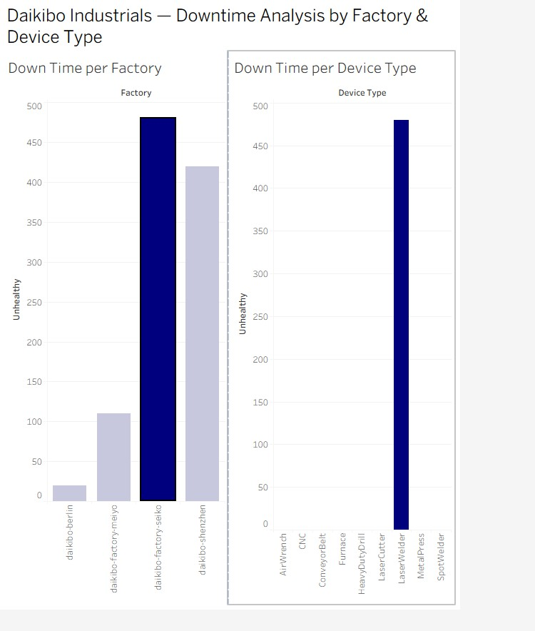

# Análisis de Downtime Industrial y Equidad Salarial - Daikibo Industrials

*Proyecto basado en el Deloitte Australia Data Analytics Job Simulation (Forage)*

## Contexto del caso

Daikibo Industrials es una empresa manufacturera con 4 fábricas ubicadas en Tokio, Osaka, Berlín y Shenzhen. La empresa necesitaba responder dos preguntas de negocio distintas, cada una abordada con una herramienta diferente:

1. **Downtime operacional**: ¿en qué fábrica se rompen más las máquinas, y qué tipo de máquina es la más problemática en esa fábrica?
2. **Equidad salarial**: tras recibir quejas internas sobre desigualdad de género en las remuneraciones, ¿cómo se distribuyen los niveles de inequidad salarial por fábrica y cargo?

## Parte 1: Análisis de Downtime (Tableau)

### Los datos
Cada una de las 4 fábricas tiene 9 tipos de máquinas que envían un mensaje de estado ("healthy" / "unhealthy") cada 10 minutos. Los datos de mayo 2021 llegaron en un único archivo JSON anidado, con más de 160.000 registros.

### El proceso
- Importé el JSON en Tableau, asegurando incluir todos los niveles del esquema (los datos de estado y ubicación estaban anidados dentro de sub-objetos, y de no marcarlos, esa información quedaba fuera del análisis).
- Creé un campo calculado **"Unhealthy"** que asigna 10 minutos de downtime a cada registro con estado "unhealthy" (representando el tiempo hasta el siguiente mensaje de control), y 0 en caso contrario. Esto transforma un dato de estado puntual en una métrica acumulable de tiempo de inactividad.
- Construí dos visualizaciones: downtime total por fábrica, y downtime total por tipo de máquina.
- Conecté ambos gráficos mediante un filtro interactivo: al seleccionar una fábrica en el primer gráfico, el segundo se actualiza mostrando solo las máquinas de esa fábrica — permitiendo aislar el problema específico dentro de la ubicación más afectada.

### Resultado
La fábrica **Seiko** concentra el mayor tiempo de inactividad, y dentro de ella, el **LaserWelder** es el tipo de máquina que más contribuye al problema, un hallazgo accionable para priorizar mantenimiento preventivo.



## Parte 2: Clasificación de Equidad Salarial (Excel)

### Los datos
Un equipo de "Forensic Tech" había calculado previamente un **Equality Score** (entre -100 y +100, donde 0 es el ideal) para distintos cargos en cada fábrica. Mi tarea fue clasificar cada score en 3 categorías: Fair, Unfair, y Highly Discriminative.

### Una ambigüedad en el enunciado
El enunciado original definía los rangos de forma contradictoria con su propio ejemplo (indicaba que "Fair" cubría el rango -10 a +10, pero el ejemplo mostraba -9 como "Unfair", lo cual no calzaba con esa regla). En vez de asumir una interpretación al azar, investigué cómo otros analistas resolvieron la misma ambigüedad y confirmé la lógica más consistente con la mayoría de los ejemplos:

- **Fair**: valor absoluto del score ≤ 10
- **Unfair**: valor absoluto del score entre 11 y 20
- **Highly Discriminative**: valor absoluto del score > 20

Implementé esto con la fórmula:
```excel
=SI(ABS(C2)>20;"Highly Discriminative";SI(ABS(C2)>10;"Unfair";"Fair"))
```

### Resultado
[Completa con tu insight: ej. "Daikibo Factory Seiko concentra la mayor proporción de cargos clasificados como 'Highly Discriminative', mientras que Daikibo Berlín muestra los scores más equilibrados, sugiriendo que la intervención debería priorizarse en Seiko."]

## Herramientas utilizadas
- **Tableau** — modelado de datos JSON, campos calculados, dashboards interactivos
- **Excel** — lógica condicional anidada, clasificación de datos

## Reflexión
Este proyecto refuerza mi experiencia previa como analista en el área de finanzas, donde trabajé con datos operacionales y de negocio para apoyar la toma de decisiones. Aquí apliqué el mismo enfoque analítico — transformar datos crudos en métricas accionables — en un contexto industrial y de recursos humanos, ampliando mi manejo de Tableau como herramienta de visualización.
